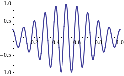

An animation of a 1D Electromagnetic wave (credit: wiki-media commons)

```{r, echo = FALSE}
knitr::include_graphics("EM-Wave.gif")
```


An animation of a 1D wave packet, with phase velocity opposing the group velocity (credit: wiki-media commons)

```{r, echo = FALSE}

```


James Webb Telescope

```{r, echo = FALSE}
knitr::include_graphics("jwst_1.jpg")
```
